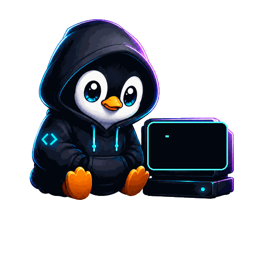

  

# Hey, I'm Nischal 👋

### BSc (Hons) CSE Student  
### Linux • Android • Open Source • Full Stack Development

---

## About Me

I am a BSc (Hons) CSE student exploring Linux, Android, open source, and full-stack development through practical projects.

I enjoy learning by building, breaking, fixing, and improving things step by step.

---

## Tech Stack

  
  
  
  
  
  
  
  
  

---

### Building quietly, learning deeply, and improving one commit at a time.

