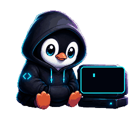
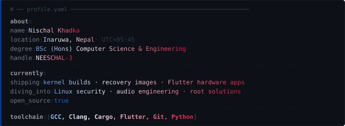

  

  <picture>
    <source media="(prefers-color-scheme: dark)" srcset="./assets/title_neon.svg">
    <source media="(prefers-color-scheme: light)" srcset="./assets/title_light.svg">
    
  </picture>

  <code>BSc (Hons) Computer Science &amp; Engineering</code> &nbsp;•&nbsp; <code>Nepal &nbsp;</code>

 
<picture>
  <source media="(prefers-color-scheme: dark)" srcset="./assets/cyber_divider.svg">
  <source media="(prefers-color-scheme: light)" srcset="./assets/cyber_divider_light.svg">
  
</picture>

<picture>
  <source media="(prefers-color-scheme: dark)" srcset="./assets/heading_identity.svg">
  <source media="(prefers-color-scheme: light)" srcset="./assets/heading_identity_light.svg">
  
</picture>

<picture>
  <source media="(prefers-color-scheme: dark)" srcset="./assets/identity_yaml.svg">
  <source media="(prefers-color-scheme: light)" srcset="./assets/identity_yaml_light.svg">
  
</picture>

  <picture>
    <source media="(prefers-color-scheme: dark)" srcset="./assets/cyber_divider.svg">
    <source media="(prefers-color-scheme: light)" srcset="./assets/cyber_divider_light.svg">
    
  </picture>

<picture>
  <source media="(prefers-color-scheme: dark)" srcset="./assets/heading_arsenal.svg">
  <source media="(prefers-color-scheme: light)" srcset="./assets/heading_arsenal_light.svg">
  
</picture>

<table>
  <thead>
    <tr>
      <th width="33%" align="left"><b>01 / SYSTEMS &amp; LOW-LEVEL</b></th>
      <th width="33%" align="left"><b>02 / LANGUAGES &amp; RUNTIMES</b></th>
      <th width="33%" align="left"><b>03 / WORKFLOW &amp; TOOLING</b></th>
    </tr>
  </thead>
  <tbody>
    <tr valign="top">
      <td>
         
         
         
         
        
      </td>
      <td>
         
         
         
         
        
      </td>
      <td>
         
         
         
         
        
      </td>
    </tr>
  </tbody>
</table>

  <picture>
    <source media="(prefers-color-scheme: dark)" srcset="./assets/cyber_divider.svg">
    <source media="(prefers-color-scheme: light)" srcset="./assets/cyber_divider_light.svg">
    
  </picture>

<picture>
  <source media="(prefers-color-scheme: dark)" srcset="./assets/heading_builds.svg">
  <source media="(prefers-color-scheme: light)" srcset="./assets/heading_builds_light.svg">
  
</picture>

<table>
  <tr>
    <td width="50%" valign="top">
      <h3><a href="https://github.com/NEESCHAL-3/EVONIX-Kernel">EVONIX-Kernel</a></h3>
      
Custom Android kernel built on Linux 6.6 — tuned for performance, stability, and deep hardware access on Android 15.

      <code>Linux 6.6</code> <code>C</code> <code>Android 15</code> <code>AOSP</code>
    </td>
    <td width="50%" valign="top">
      <h3><a href="https://github.com/NEESCHAL-3/OrangeFox-rodin-source">OrangeFox Recovery</a></h3>
      
Runtime-verified custom recovery source — enables flashing, backup, decryption, and system-level modification.

      <code>Recovery</code> <code>Shell</code> <code>Android</code> <code>Device Tree</code>
    </td>
  </tr>
  <tr>
    <td width="50%" valign="top">
      <h3><a href="https://github.com/NEESCHAL-3/Rodin-Essential">Rodin-Essential</a></h3>
      
Native hardware-control suite built with Flutter & Rust — direct hardware access with a clean native UI.

      <code>Flutter</code> <code>Rust</code> <code>Dart</code> <code>Hardware</code>
    </td>
    <td width="50%" valign="top">
      <h3><a href="https://github.com/NEESCHAL-3/FaceAuth">FaceAuth</a></h3>
      
Open-source PAM module that brings face-based authentication to Linux — plugs into the system auth stack.

      <code>Linux</code> <code>PAM</code> <code>Python</code> <code>Security</code>
    </td>
  </tr>
  <tr>
    <td width="50%" valign="top">
      <h3><a href="https://github.com/NEESCHAL-3/ViPER4Android">ViPER4Android</a></h3>
      
Rebuilt ViPER4Android with Material Design 3 — modern UI on top of a powerful audio effects engine.

      <code>Android</code> <code>Material 3</code> <code>Audio</code>
    </td>
    <td width="50%" valign="top">
      <h3><a href="https://github.com/NEESCHAL-3/Rodin-Capability-Extension">Rodin-Capability-Extension</a></h3>
      
Capability extension module that unlocks Pro Audio, Unprocessed Audio Source, and Secure NFC via overlay & SKU normalization.

      <code>Shell</code> <code>Android</code> <code>Audio</code> <code>NFC</code>
    </td>
  </tr>
</table>

 

<picture>
  <source media="(prefers-color-scheme: dark)" srcset="./assets/cyber_divider.svg">
  <source media="(prefers-color-scheme: light)" srcset="./assets/cyber_divider_light.svg">
  
</picture>

Building quietly, learning deeply, and improving one commit at a time.

